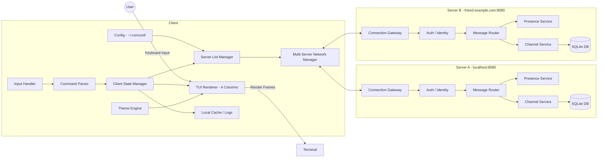
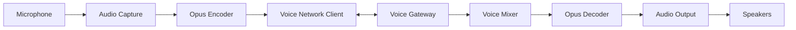

This document describes the high-level technical architecture of the terminal-based chat application, with a clear separation between **Text** and **Voice** subsystems and an emphasis on extensibility and maintainability.

---

## High-Level Overview



---

## Client-Side Architecture

### 1. TUI Renderer (Four-Column Layout)

- **Column 1**: Server Icons (~10 chars)
    - Colored circles with server initials
    - Active server highlighting
    - Unread indicators per server

- **Column 2**: Channels (~30 chars)
    - Folder explorer-style hierarchical layout
    - Collapsible channel categories
    - Indented nested structure
    - Category and channel names

- **Column 3**: Chat (flexible, fills remaining space)
    - Message history viewport
    - Input bar at bottom
    - Sender info with colored circle avatars

- **Column 4**: Members (~30 chars)
    - Grouped by role (Admin, Moderator, Member)
    - Colored circle avatars with initials
    - Presence indicators
    - Collapsible (can overlay chat on narrow screens)

- Stateless rendering based on current client state

- Theme-aware (no hardcoded colors)

- **Minimum Width**: 160 columns recommended
    

### 2. Input Handler

- Captures keyboard input
    
- Routes input to either:
    
    - Message composer
        
    - Navigation logic
        
    - Command parser
        

### 3. Command Parser

- Slash-command parsing (`/join`, `/theme`, etc.)
    
- Validation and autocomplete hooks
    
- Emits structured commands to state manager
    

### 4. Client State Manager

- Single source of truth for UI state

- Tracks:

    - Multiple connected servers (IRC-like model)

    - Active server and channel

    - Per-server channels and categories

    - Users & presence (per server)

    - Message buffers (per channel per server)

    - Collapsed/expanded category states

    - Focus area (server icons, channels, chat, members)

- Emits events to renderer

- Coordinates with Server List Manager for connections


### 4b. Server List Manager

- Manages client-side server list

- Loads/saves ~/.concord/servers.json

- Server configuration:

    - Server ID, name, address, port

    - Last connected timestamp

    - Saved credentials (optional, encrypted tokens)

- Default user preferences:

    - Username and email for new server registrations

    - Allows consistent alias across servers

- Handles "Add Server" UI workflow

- Connection state tracking per server
    

### 5. Network Client

- Persistent connection management
    
- Serialization / deserialization
    
- Reconnect & retry logic
    
- Protocol-version awareness
    

### 6. Theme Engine

- Loads theme definitions
    
- Maps semantic roles → terminal colors
    
- Hot-swappable at runtime
    

### 7. Local Cache / Logs

- Message history persistence

- Offline access

- Debug and audit logs


### 8. Client-Side Configuration

**~/.concord/servers.json** - Server list and preferences
```json
{
  "servers": [
    {
      "id": "uuid-1",
      "name": "My Local Server",
      "address": "localhost",
      "port": 8080,
      "last_connected": "2026-02-05T10:30:00Z",
      "saved_credentials": {
        "email": "user@example.com",
        "token": "encrypted_token_here"
      }
    },
    {
      "id": "uuid-2",
      "name": "Friend's Server",
      "address": "friend.example.com",
      "port": 8080,
      "last_connected": "2026-02-04T15:00:00Z"
    }
  ],
  "default_user_preferences": {
    "username": "gh0st",
    "email": "ghost@example.com"
  }
}
```

**~/.concord/config.json** - Application preferences
- Theme selection
- Keybindings
- UI preferences (collapsed states, etc.)
    

---

## Server-Side Architecture

### 1. Connection Gateway

- TCP/WebSocket entry point
    
- Handles connection lifecycle
    
- Rate limiting and backpressure
    

### 2. Auth / Identity Service

- User authentication
    
- Session tokens
    
- Per-server nicknames
    

### 3. Message Router

- Routes messages to appropriate channels
    
- Fan-out to subscribed clients
    
- Enforces permissions
    

### 4. Channel Service

- Channel creation/deletion
    
- Membership management
    
- Message ordering guarantees
    

### 5. Presence Service

- Tracks online/idle/DND/offline states
    
- Heartbeat monitoring
    

### 6. Bot / Automation Service (Optional)

- Event-driven hooks
    
- Server-side scripting
    
- Moderation helpers
    

---

## Voice Subsystem (v2.0+)



### Voice Design Notes

- Completely separate from text pipeline
    
- Uses UDP where possible
    
- Independent failure domain
    
- Push-to-talk handled client-side
    

---

## Event Flow Example (Text Message)

1. User types message
    
2. Input Handler captures keystrokes
    
3. Message submitted to Client State
    
4. Serialized by Network Client
    
5. Sent to Server Gateway
    
6. Routed to Channel Service
    
7. Broadcast to subscribed clients
    
8. Client State updates
    
9. TUI re-renders
    

---

## Multi-Server Architecture Pattern

### IRC-Like Model (Decentralized)

Unlike Discord's single-hub model where one entity hosts all servers:

- Each Concord server is **independent** and **self-hosted**

- No central authority or federation

- Users connect directly to server IP addresses

- Each server has its own database and user accounts

- Client manages connections to multiple servers simultaneously


### Benefits

- **Privacy**: No centralized data collection

- **Control**: Server admins have complete autonomy

- **Simplicity**: No complex federation protocols

- **Resilience**: One server going down doesn't affect others


### Identity Management

- Users register separately on each server

- Client stores default preferences (username, email)

- When registering on new server, pre-fills with defaults

- Allows consistent alias across servers without federation

- Optional saved credentials per server for quick reconnect


## Key Architectural Decisions

- **IRC-Like Multi-Server Model**: Decentralized, independent servers

- **Client-Side Server List**: No centralized directory

- **Four-Column Fixed Layout**: Terminal aesthetic, 160+ columns

- **Folder Explorer Categories**: Hierarchical, collapsible, database-driven

- **Single State Authority (Client)**: Predictable rendering

- **Semantic Theming**: Future-proof customization

- **Parallel Voice Stack**: Avoids coupling and instability (v2.0+)

- **Event-Driven Server**: Extensible and bot-friendly
    

---

## Mental Model Summary

> Text is _stateful and ordered_.  
> Voice is _stateless and real-time_.  
> Treat them as siblings, not layers.