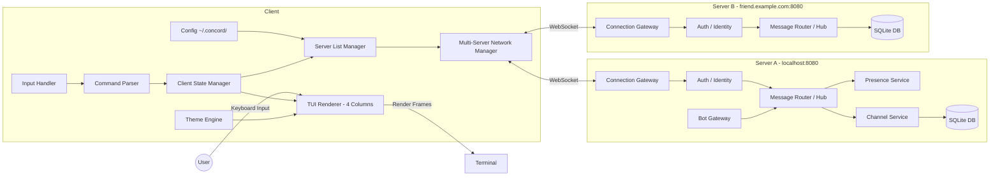
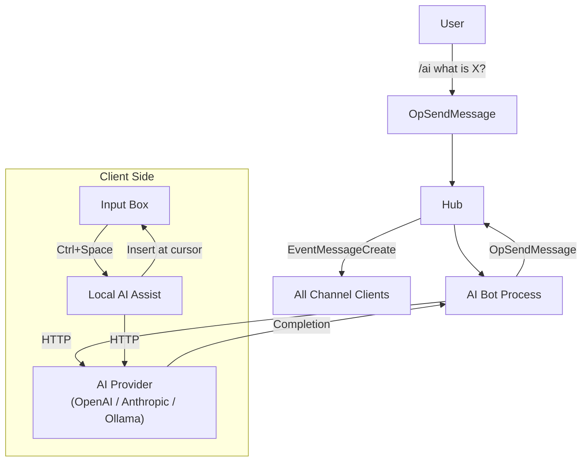
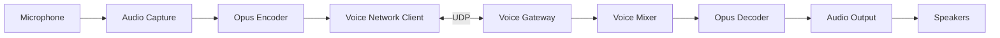

# Concord — Technical Architecture

This document describes the high-level technical architecture of Concord, with clear separation between the Text, Voice, and AI/Bot subsystems and an emphasis on extensibility.

---

## High-Level Overview



---

## Client-Side Architecture

### 1. TUI Renderer (Four-Column Layout)

**Column 1 — Server Icons** (~22 chars)

- Colored circles with server initials
- Active server highlighted
- Unread `●` dot indicator below icon
- `+` button to add new servers

**Column 2 — Channels** (~26 chars)

- Folder explorer-style hierarchical layout
- Collapsible categories (Left/Right or H/L keys)
- Unread `●` and `@N` mention count badges
- Shift+↑/Shift+↓ for in-place channel reordering
- Visual indicators: `▼` expanded, `▶` collapsed

**Column 3 — Chat** (flexible, fills remaining space)

- Scrollable message viewport (PgUp/PgDn, arrow keys)
- Colored circle avatar + sender name + right-aligned timestamp
- `@mention` tokens highlighted in sender's color
- URL hyperlinks via OSC 8 (Ctrl+Click in supported terminals)
- `[DM]` prefix for ephemeral whispers
- Multi-line input: Ctrl+J / Ctrl+Enter / Shift+Enter
- @mention autocomplete popup (type `@`, Tab to complete)

**Column 4 — Members** (~30 chars)

- Role-grouped: Admin → Moderators → Members
- Colored circle avatars (role color or deterministic palette fallback)
- Presence dots: `●` online, `○` offline
- Bot badge for AI/bot users

### 2. Input Handler

- Captures keyboard input via bubbletea key messages
- Routes to: message composer, navigation logic, or command parser
- Focus areas: Server Icons → Channels → Chat → Input → Members (Tab cycles)
- Shift+↑/↓ for channel reordering when FocusChannelList is active

### 3. Command Parser

- Slash-command parsing (`/create-channel`, `/whisper`, `/ai`, etc.)
- Tab completion for command names and @mention targets
- Emits structured commands to state manager
- Current commands: create-channel, create-category, delete-channel, delete-category, rename-channel, move-channel, theme, mute, unmute, whisper, role, kick, ban, help

### 4. Client State Manager (`App` struct)

Single source of truth for all UI state. Key fields:

| Field | Type | Purpose |
|-------|------|---------|
| `activeConn` | `*ServerConnection` | Currently displayed server connection |
| `currentClientServer` | `*ClientServerInfo` | User-selected server from the server list |
| `currentServer` | `*models.Server` | Protocol server object from READY payload |
| `currentChannel` | `*models.Channel` | Currently selected channel |
| `channelTree` | `*ChannelTree` | Hierarchical channel tree for rendering |
| `connMgr` | `*ConnectionManager` | Manages all WebSocket connections |
| `connEvents` | `chan tea.Msg` | Cross-goroutine event bus for connection events |
| `unreadCounts` | `map[uuid][uuid]int` | Unread message counts per server/channel |
| `mentionCounts` | `map[uuid][uuid]int` | @mention counts per server/channel |
| `mutedChannels` | `map[uuid]bool` | Client-side mute state |
| `theme` | `*themes.Theme` | Active theme |

**Event flow (bubbletea Elm architecture):**

```text
Keyboard / WebSocket event
    │
    ▼
Update(msg tea.Msg) → mutate App state + return tea.Cmd
    │
    ▼
View() → pure render from current state
    │
    ▼
Terminal output
```

### 5. Multi-Server Network Manager

- `ConnectionManager`: map of `serverID → ServerConnection`
- Each `ServerConnection` owns: WebSocket conn, auth token, channels, messages, members, roles
- `AutoConnectHTTP()`: HTTP-only login/register (synchronous, reliable)
- `connectServerAsync()`: WebSocket connect + Identify (async tea.Cmd)
- Two-phase design prevents READY race condition
- Events routed through `connEvents` channel → `waitForConnEvent()` → bubbletea Update loop
- All events tagged with `ServerID` via `ServerScopedMsg` wrapper

### 6. Theme Engine

- `themes.Theme` struct: `[meta]`, `[colors]`, `[semantic]` sections
- `themes.BuildStyles()` maps semantic roles → `lipgloss.Style`
- Hot-swappable at runtime: `app.SetTheme(theme)` + re-render
- Bundled themes: Dracula, Alucard Dark, Alucard Light
- TOML-based; user overrides from `~/.concord/themes/<name>.toml`

### 7. Client-Side Configuration

**`~/.concord/servers.json`** — Server list

```json
{
  "servers": [
    {
      "id": "uuid",
      "name": "My Server",
      "address": "localhost",
      "port": 8080,
      "saved_credentials": { "email": "...", "token": "..." }
    }
  ],
  "default_user_preferences": { "username": "gh0st", "email": "ghost@example.com" }
}
```

**`~/.concord/config.json`** — Application preferences

```json
{
  "version": 1,
  "identity": { "alias": "gh0st", "email": "...", "password": "..." },
  "ui": {
    "theme": "alucard-dark",
    "collapsed_categories": {},
    "muted_channels": []
  }
}
```

---

## Server-Side Architecture

### 1. Connection Gateway (`server/server.go`)

- HTTP endpoints: `POST /api/register`, `POST /api/login`
- WebSocket upgrade at `/ws`
- Handles connection lifecycle; spawns a `Client` goroutine per connection
- Rate limiting and back-pressure (planned v1.0)

### 2. Auth / Identity Service

- bcrypt password hashing
- JWT-style session tokens (stored in `sessions` table)
- `OpInvalidSession` sent to client when token is rejected
- Per-server user accounts (no federation)

### 3. Message Router / Hub (`server/hub.go`)

- `Hub` struct: `clients`, `serverClients`, `channelClients` maps
- `BroadcastToServer()` — fan-out to all users in a server
- `BroadcastToChannel()` — fan-out to users currently in a channel
- `SendToUser()` — targeted delivery (whispers, error responses)
- `TypingManager` — tracks and expires typing indicators (10s TTL)
- Thread-safe via `sync.RWMutex`; broadcast channel buffered at 256

### 4. Channel Service (`server/handlers.go`)

- `HandleCreateChannel` / `HandleUpdateChannel` / `HandleDeleteChannel`
- Permission checks via `HasPermission()` before any mutation
- `channel.Position` updated and broadcast on `OpChannelUpdate`
- `BroadcastToServer()` ensures all connected clients see changes

### 5. Presence Service

- Online: client registered in `hub.clients`
- Offline: `unregisterClient()` broadcasts `StatusOffline` to all shared servers
- `EventPresenceUpdate` payload includes full user object + new status
- Client updates `MemberDisplay.User.Status` on receipt

### 6. Bot Gateway (v0.6.0+)

- Bots authenticate with `OpIdentify` + `is_bot: true`
- Receive events they subscribe to (allow-list per bot)
- Send messages via `OpSendMessage` — same path as human users
- Bot users stored in `users` table with `is_bot = 1`
- Rate limits enforced separately from human users

---

## AI Subsystem (v0.7.0+)



### AI Design Principles

- **AI as Bot**: The AI assistant runs as a regular bot user over the bot gateway. No special server privileges. Disabling AI = not running the bot process.
- **Provider-agnostic**: Any OpenAI-compatible API works (OpenAI, Anthropic via proxy, Ollama, LM Studio, Together AI).
- **Context window**: Last N messages from the channel are included as conversation history.
- **Privacy controls**: Users can `/ai-optout` to exclude their messages from AI context.
- **Rate limits**: Per-user and per-channel limits enforced by the AI bot process.

### Key AI Features

| Feature | Command | Scope |
|---------|---------|-------|
| One-off query | `/ai <prompt>` | Channel (visible to all) |
| Private query | `/ai --private <prompt>` | Whisper (only you see response) |
| Summarize | `/summarize [N]` | Last N messages |
| AI persona | `/ai-config system-prompt <text>` | Per-channel, admin only |
| Compose help | Ctrl+Space in input box | Client-side, not sent to chat |
| Opt out | `/ai-optout` | Per-user, persisted |

---

## Voice Subsystem (v2.0+)



### Voice Design Notes

- Completely separate from text pipeline — independent failure domain
- UDP where possible; TCP fallback for restrictive NATs
- Push-to-talk handled client-side (no server processing until PTT active)
- Speaking indicators via lightweight heartbeat to text server (not voice path)

---

## WebSocket Protocol Summary

### Opcodes

| Op | Name | Dir | Purpose |
|----|------|-----|---------|
| 0 | OpIdentify | C→S | Authenticate with token |
| 1 | OpHeartbeat | C→S | Keep-alive ping |
| 3 | OpSendMessage | C→S | Send chat message |
| 4 | OpTypingStart | C→S | Typing indicator |
| 5 | OpPresenceUpdate | C→S | Update own status |
| 7 | OpChannelCreate | C→S | Create channel/category |
| 8 | OpChannelUpdate | C→S | Rename/reorder channel |
| 9 | OpChannelDelete | C→S | Delete channel/category |
| 10 | OpDispatch | S→C | All server→client events |
| 11 | OpHeartbeatAck | S→C | Heartbeat response |
| 12 | OpHello | S→C | Initial connection info |
| 13 | OpReady | S→C | Auth success + initial state |
| 14 | OpInvalidSession | S→C | Auth failure |
| 16 | OpRequestMessages | C→S | Fetch message history |
| 17 | OpRoleAssign | C→S | Assign role to member |
| 18 | OpRoleRemove | C→S | Remove role from member |
| 19 | OpKickMember | C→S | Kick a member |
| 20 | OpBanMember | C→S | Ban a member |
| 21 | OpMuteMember | C→S | Server-mute a member |
| 22 | OpWhisper | C→S | Ephemeral in-memory DM |

### Event Types (OpDispatch payload)

| Event | Trigger |
|-------|---------|
| `READY` | Sent after successful `OpIdentify` |
| `SERVER_CREATE` | Server info + channels + members on join |
| `SERVER_MEMBER_ADD` | New user authenticated on this server |
| `SERVER_MEMBER_REMOVE` | User kicked or left |
| `SERVER_MEMBER_UPDATE` | Role change, mute state change |
| `CHANNEL_CREATE` | New channel or category created |
| `CHANNEL_UPDATE` | Channel renamed, moved, or reordered |
| `CHANNEL_DELETE` | Channel or category deleted |
| `MESSAGE_CREATE` | New chat message |
| `MESSAGES_HISTORY` | Response to `OpRequestMessages` |
| `PRESENCE_UPDATE` | User status changed (online/offline/idle) |
| `TYPING_START` | User started typing |
| `WHISPER_CREATE` | Ephemeral DM received |

---

## Event Flow: Text Message (End-to-End)

```text
1. User types message, presses Enter
2. handleSendMessage() called in Update()
3. connMgr.SendMessage(serverID, channelID, content) → OpSendMessage over WebSocket
4. Server: HandleSendMessage() validates permissions, saves to DB
5. Server: hub.BroadcastToChannel() → sends EventMessageCreate to all channel subscribers
6. Client A: waitForConnEvent() unblocks → ServerScopedMsg{EventMessageCreate}
7. handleDispatch() → sc.AddMessage() → updateChatContent() → scrollToBottom()
8. View() re-renders chat panel with new message
```

---

## Multi-Server Pattern

Unlike Discord's single-hub model, every Concord server is independent:

- No central authority; no federation
- Users connect directly to IP:Port
- Each server has its own DB, user accounts, and roles
- Client manages connections to multiple servers simultaneously
- `currentClientServer.ID` (client-side) maps to WebSocket connection; `currentServer.ID` (protocol) is the server UUID from READY

---

## Key Architectural Decisions

| Decision | Rationale |
|----------|-----------|
| IRC-like multi-server model | Decentralization, privacy, no central failure point |
| bubbletea Elm architecture | Predictable single-threaded state, no render races |
| ServerScopedMsg + connEvents | Routes multi-server events through bubbletea without blocking |
| Two-phase WebSocket connect | HTTP auth first (sync) then WS (async) prevents READY race |
| Pure-Go SQLite (modernc) | No CGO, works on all platforms without build toolchain |
| OSC 8 hyperlinks (ST terminator) | `ESC]8;;URL\ESC\` works in Windows Terminal; BEL does not |
| AI as Bot (not core protocol) | AI is opt-in, provider-agnostic, and trivially removable |
| Parallel voice stack | Avoids coupling unstable audio code to stable text protocol |

---

## Mental Model Summary

> Text is _stateful and ordered_.
> Voice is _stateless and real-time_.
> AI is _contextual and advisory_.
> Treat all three as siblings, not layers.
